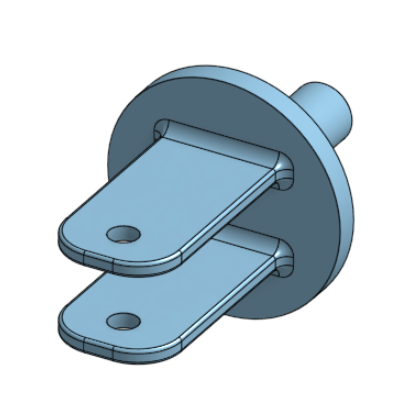

# BasicOnshape
This is my repository for basic CAD.

## Table of Contents 
* [Base](#Base)
* [Mount](#Fork)
* [Fork](#Fork) 
* [Tire](#Tire)
* [Wheel](#Wheel)

## Base 

### Description 
This assingment I had to build a base for a caster. The dimensions were 200mm by 120mm and 8mm thick. It has 6 holes which are 10mmwide and 20mm from the edge spaced equally along the edges.
### Image 

### Evidence 
[Base](https://cvilleschools.onshape.com/documents/b08f00f1ce583137b1b9e5b0/w/5e42dc8ca2b568cac2af11da/e/3602bdf8b3430cb29f84bb1f)

### Reflection 
This project wasn't very difficult. I learned things about Onshape since this was my first time ever using it. I learned shortcuts for the program. It was my first project I had ever done with Onshape and I'm looking forward to more of them. 

## Mount

### Description 
For this assingment I had to make a mount. I used the steps in Canvas to work on the first part but as I kept working I was able to do it without the help of the instructions. 
### Image

### Evidence 
[Mount](https://cvilleschools.onshape.com/documents/a4dd878735d83367e5cd03f4/w/612c5442af2664bcad290162/e/3dc37ab41c8a8945081dc2a5)
### Reflection 
This assingment was pretty easy it was sort of like the base but shorter so I didn't have much trouble with it. This assingment gave me mor practice for the upcoming assingment which may be harder. 

## Fork 

### Description 
For this assingment I was tasked with making a fork. I did a project like this last year so it was pretty quick and easy, but for some parts that I didn't remember I had to go back to the instructions. I was also learned how to use the mirror tool on OnShape. 
### Image

### Evidence 
[Fork](https://cvilleschools.onshape.com/documents/41c3d32005302046eb4411d8/w/4b17956c4a2c9ad933812241/e/10131a31bd23875b6038b602)

### Reflection 
This project was simple and quick like the last. The instructions are not step by step anymore. It's making us think more of what we did in the past to apply it now. I didn't have any problems or issues while doing this assingment. 

## Tire

### Description
This assingment was the fourth step to completing my caster. The tire was pretty simple 
### Image
### Reflection 

## Wheel
### Description 
### Image
### Reflection 

## Group Collaboration 
### Description 
### Image
### Evidence 
### Reflection
