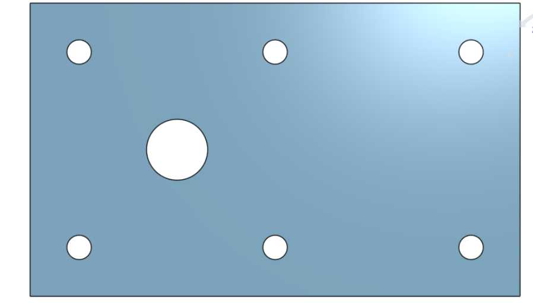
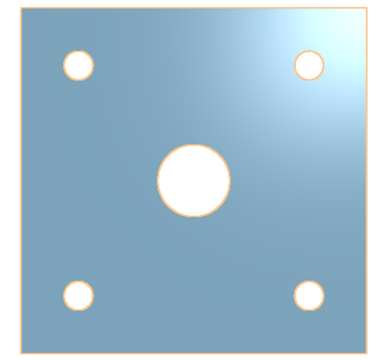

# BasicOnshape
This is my repository for basic CAD.

## Table of Contents 
* [Base](#Base)
* [Mount](#Fork)
* [Fork](#Fork) 
* [Tire](#Tire)
* [Wheel](#Wheel)

## Base 

### Description 
This assingment I had to build a base for a caster. The dimensions were 200mm by 120mm and 8mm thick. It has 6 holes which are 10mmwide and 20mm from the edge spaced equally along the edges.
### Image 

### Evidence 
[Base](https://cvilleschools.onshape.com/documents/b08f00f1ce583137b1b9e5b0/w/5e42dc8ca2b568cac2af11da/e/3602bdf8b3430cb29f84bb1f)

### Reflection 
This project wasn't very difficult. I learned things about Onshape since this was my first time ever using it. I learned shortcuts for the program. It was my first project I had ever done with Onshape and I'm looking forward to more of them. 

## Mount

### Description 
For this assingment I had to make a mount. I used the steps in Canvas to work on the first part but as I kept working I was able to do it without the help of the instructions. 
### Image

### Evidence 
[Mount](https://cvilleschools.onshape.com/documents/a4dd878735d83367e5cd03f4/w/612c5442af2664bcad290162/e/3dc37ab41c8a8945081dc2a5)
### Reflection 

## Fork 
### Description 
### Image
### Reflection 

## Tire
### Description 
### Image
### Reflection 

## Wheel
### Description 
### Image
### Reflection 

